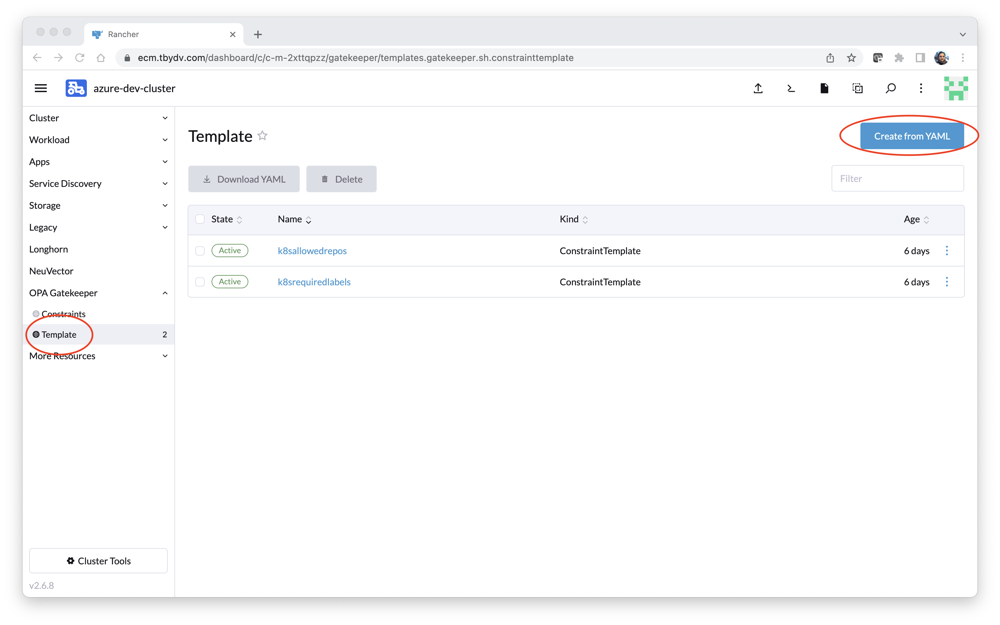
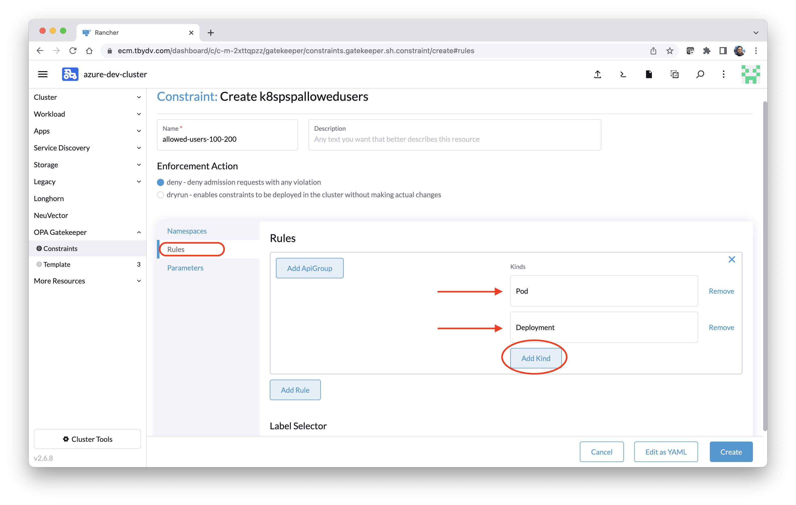
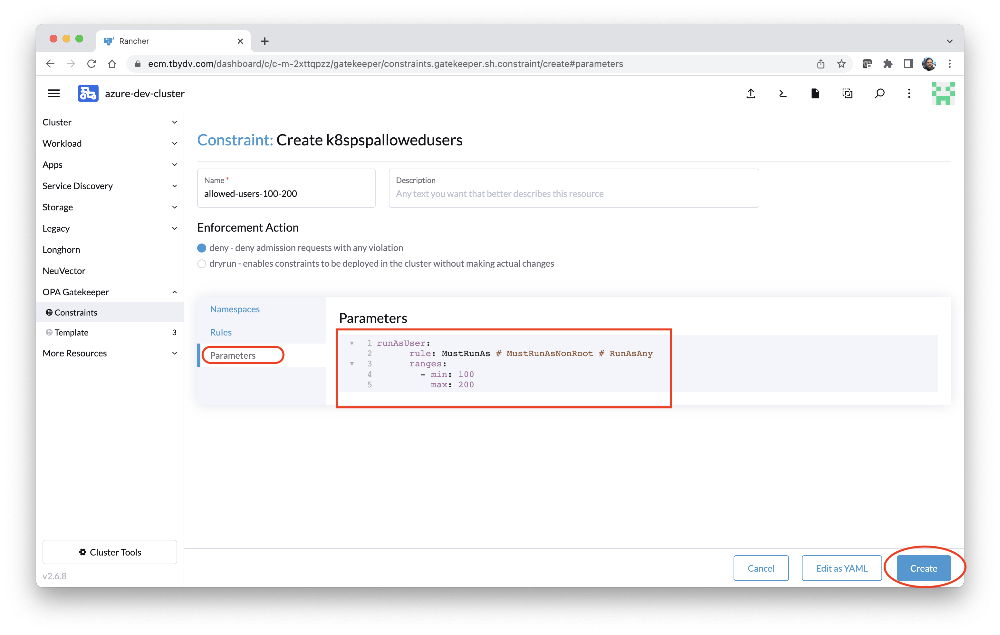

# Lab 1 A - Installing OPA, defining Template and setting up OPA constraint

This exercise is independent. We'll experience ease of installing Open Policy Agent (OPA) from Rancher cluster tools and quickly setup the constaint to allow run only non-root containers. 

###### Usecase: Generally docker containers run with root privileges which is useful for the developers because of unrestricted container management e.g. installing packages, changing configurations, associating privileged ports etc. But running containers as root in QA and Production isn't a good security practice and can cause malicious process to gain non-federated access which in turn be catastrophic. Using OPA, we can create such policy which restrict cluster to run container as root user.     


## Action 1: Install Open Policy Agent (OPA) 

This action will involve 2 steps from 2B.1 to 2B.2

**Step 1A.1)** Ensure that you are logged in to the Rancher (Refer to the Step 1 of section **Before We Begin**). Click on `Hamburger Menu icon (1)`. It will show list of clusters. Alternatively click on `Cluster Management (2)` .


**Step 1A.2)** Click on `Explore` button on downstream cluster `rke2-cluster1` from the main screen.


**Step 1A.3)** Now click on `Cluster Tools` on the botton of the left hand side static menu.  


**Step 1A.4)** Identify **OPA Gatekeeper** card and click on `Install` button. 


**Step 1A.5)** Choose `Default` value from **Install into Project** and click on `Next` button. 


**Step 1A.6)** Now click on `Install` button. 


**Step 1A.7)** Verify that installation is successfully completed and SUCCESS message is displayed. Close the logging screen by clicking on "x" button.  


**End of Action 1**


## Action 2: Define OPA Template

This action will involve 4 steps from 1A.8 to 1A.11

**Step 1A.8)** Go to `OPA Gatekeeper` menu option and select `Template`. Now click on `Create from YAML` at the right upper screen. 



**Step 1A.9)** Remove pre-filled text from the template editor. 


**Step 1A.10)** Specify template.yaml file content in the editor. Please refer below git link (Please open link in new tab)

[OPA-User-Template](/template.yaml)


**Step 1A.11)** Verify that template `k8spspallowedusers` is successfully create. 


**End of Action 3**

## Action 3: Setup OPA Constraint

This action will involve 6 steps from 1A.12 to 1A.17

**Step 1A.12)** A new **OPA Gatekeeper** menu will appear in left side static menu. Expand menu and click on `Constratint` submenu. Click on `Create` to proceed. 


**Step 1A.13)** Select `k8spspallowedusers` from the screen. 


**Step 1A.14)** Fill in the following details and click on `Rules` link. 

`Name : user's choice e.g. allowed-users-100-200`

`Enforcement Action : deny-deny admission request with any violation (Default)`

`Scope : Namespaced (From the dropdown)`

`Excluded Namespaces : kube-system, cattle-* (Manually choose all "cattle-" namespces)`


**Step 1A.15)** Click on Add `Kind` button twice to create two rows for Kind values. Fill values `Pod` and `Deployment`. Now click on `Parameters` link.  



**Step 1A.16)** Specify following yaml values and click `Create`.  

```yaml
runAsUser:
      rule: MustRunAs # MustRunAsNonRoot # RunAsAny 
      ranges:
        - min: 100
          max: 200
```




**Step 1A.17)** Verify that constraint is successfully created. Now proceed to validate if the defined constraint is working as expected i.e. deployment pulling container image from ACR will be successful while Harbor will be failed. 

Now click on `Workload` option from the left hand static menu and select `Deployments` sub menu. 


**End of Action 3**

**End of Exercise 1A**

Continue to: [Exercise 1B-Validate OPA Gatekeeper](https://github.com/dsohk/rancher-private-registry-workshop/blob/main/docs/Exercise-01B-TestOPAConstraint.md)


