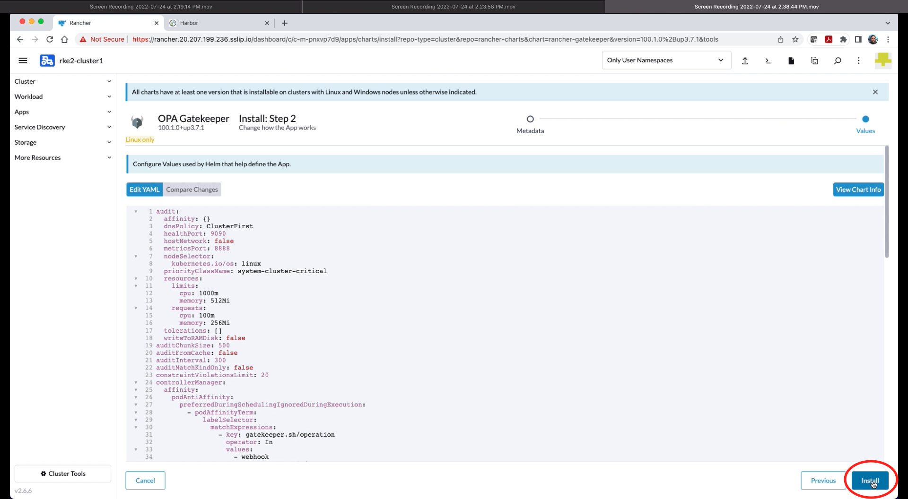
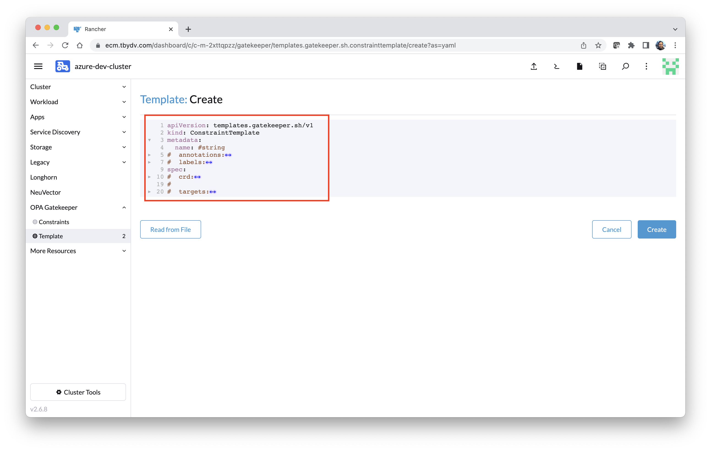
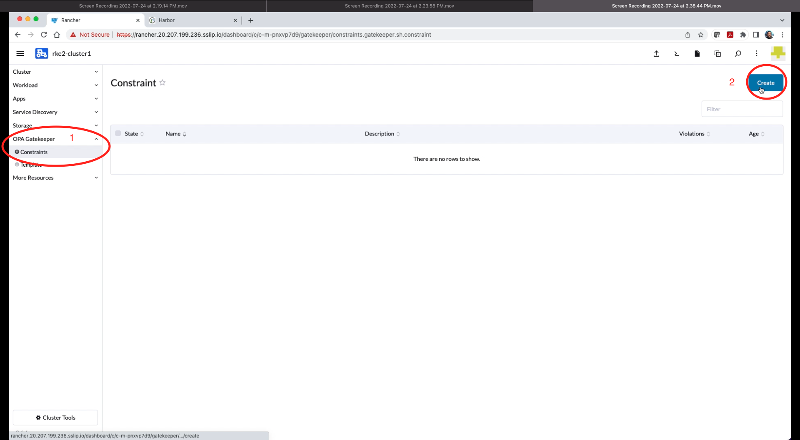
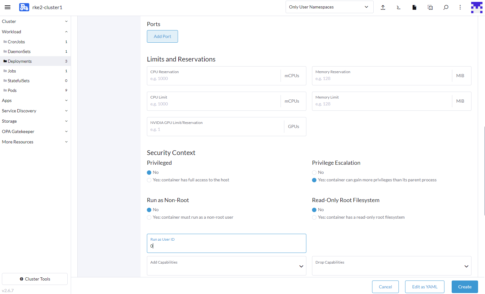

# Lab 1 A - Installing OPA, defining Template and setting up OPA constraint

This exercise is independent. We'll experience ease of installing Open Policy Agent (OPA) from Rancher cluster tools and quickly setup the constaint to allow only specific registries for deployment. 

###### Usecase: At a time development and operations may need seperate/multiple container registries and it imposes security challenges. The Open Policy Agent Gatekeeper project can be leveraged to help enforce policies and strengthen governance in your Kubernetes environment. Rancher provides OPA Gatekeeper straight from the Cluster Tools to install and setup policies within few clicks. 


## Task 1: Install Open Policy Agent Gatekeeper (OPA Gatekeeper) 

**Step 1)** 

Ensure that you are logged in to the Rancher (Refer to the Step 1 of section **Before We Begin**). Click on `Hamburger Menu icon (1)`. It will show list of clusters. Alternatively click on `Cluster Management (2)` .


**Step 2)** 

Click on `Explore` button on downstream cluster `rke2-cluster1` from the main screen.


**Step 3)** 

Now click on `Cluster Tools` on the botton of the left hand side static menu.  


**Step 4)** 

Identify **OPA Gatekeeper** card and click on `Install` button. 


**Step 5)** 

Choose `Default` value from **Install into Project** and click on `Next` button. 


**Step 6)** 

Now click on `Install` button. 




**Step 7)** 

Verify that installation is successfully completed and SUCCESS message is displayed. Close the logging screen by clicking on "x" button.  


----


## Task 2: Define OPA Template

**Step 1)** 

Go to `OPA Gatekeeper` menu option and select `Template`. Now click on `Create from YAML` at the right upper screen. 


**Step 2)** 

Remove pre-filled text from the template editor. 



**Step 3)** 

Specify template.yaml file content in the editor. Please refer below git link

https://github.com/dsohk/rancher-opa-neuvector-kubewarden-workshop/blob/0df016defee05fa0744ea7fe2f5cc94a244a5ed5/template.yaml


**Step 4)** 

Verify that template `k8spspallowedusers` is successfully create. 


----


## Task 3: Setup OPA Constraint

**Step 1)** 

A new **OPA Gatekeeper** menu will appear in left side static menu. Expand menu and click on `Constratint` submenu. Click on `Create` to proceed. 




**Step 2)** 

Select `k8spspallowedusers` from the screen. 


**Step 3)** 

Fill in the following details for the constrain as below. 

`Namespace Tab` , select `Scope` = `Namespaced`

Under Namespace, select your own namespace you wish to apply the policy for. Example  `Namespace`= `demo`. The namespace need to be created prior to this activity. In-case if you haven't please do so now.  

Choose the namespace you want the Policy to exclude.  Example `Excluded Namespaces : kube-system, cattle-* (Manually choose all "cattle-" namespces)`


**Step 4)** 

Click on `Rules Tabs` > Click on Add `Kind` button twice to create two rows for Kind values. 

Fill values `Pod` and `Deployment`. 


In the `Parameters Tab` Specify following yaml values and click `Create`.  

```yaml
runAsUser:
      rule: MustRunAs # MustRunAsNonRoot # RunAsAny 
      ranges:
        - min: 100
          max: 200
```


**Step 5)** 

Verify that constraint is successfully created. Now proceed to validate if the defined constraint is working as expected i.e. deployment pulling container image from ACR will be successful while Harbor will be failed. 

Now click on `Workload (2)` option from the left hand static menu and select `Deployments` sub menu. 


----


## Task 4 - Demonstrate OPA gatekeeper

TODO: 

We need to demonstrate how this OPA gatekeeper can deny the pods that runs with pid outside the specified range.

**Step 1)**

Cluster > Workload > Deployments


**Step 2)** 

Provide Name, Namespace, Description to the Deployment.

Click on `Container Tab`  to provide Container Name (Optional) & provide Container Image as `nginxinc/nginx-unprivileged:latest`


Scroll down to Security Context. In the `Run as User ID` provide UID anything expect the range `100-200` as our admission policy contains that range. 

Finally leave other setting to default & click on `Create` 



**Step 3)** 

If our OPA Gatekeeper Policy is working properly, we should expect error during deployment and sure we do have error creating our deployment as we are not satisfying OPA Gatekeeper policy. 


**Step 4)** 

Now let's change the `Run as User ID` provide UID in the expect the range `100-200`

Click on 3 Vertical dot on the right hand side of the page & edit deployment.


Click on `Container Tab`  and scroll down to Security Context. In the `Run as User ID` put the value `100` or any value of your choice in the range of `100-200`


Leave other setting to default & click on `Create`.

**Step 5)** 

Click on 3 Vertical dot on the right hand side of the page & hit `Redeploy`to restart the deployment. You will not observe that Gatekeeper will allow the deployment to go through as it satisfied all the requirement.

 

You will now see the Container spun up & running. 


Continue to: [Exercise 1B-Validate OPA Gatekeeper](https://github.com/dsohk/rancher-private-registry-workshop/blob/main/docs/Exercise-01B-TestOPAConstraintForHarborDocker.md)


