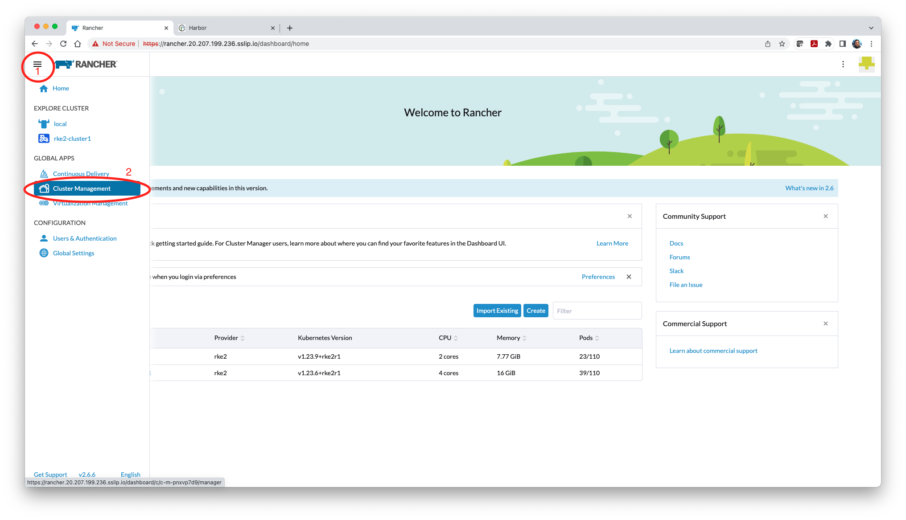
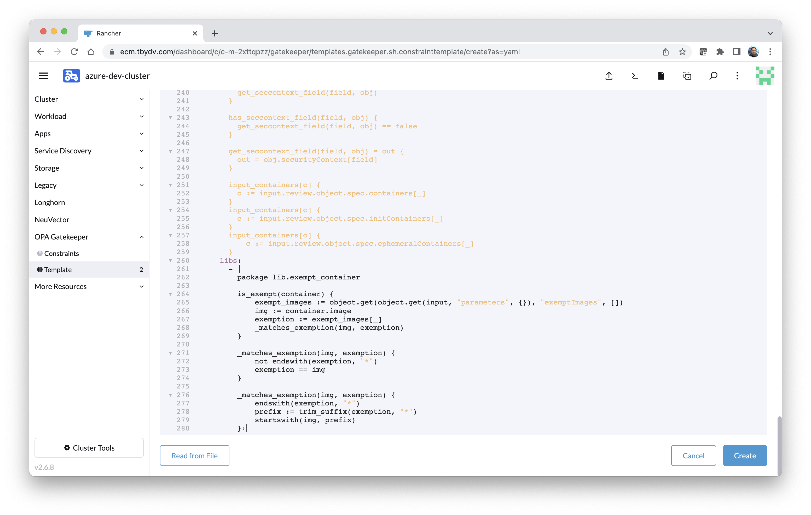
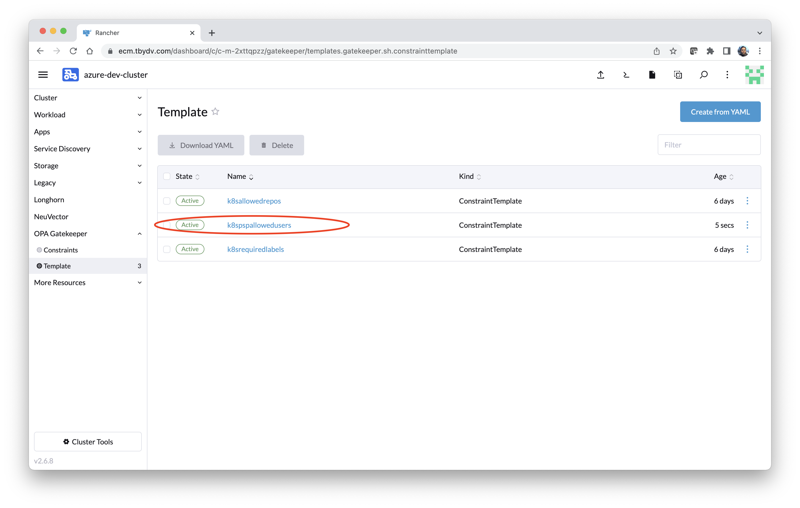
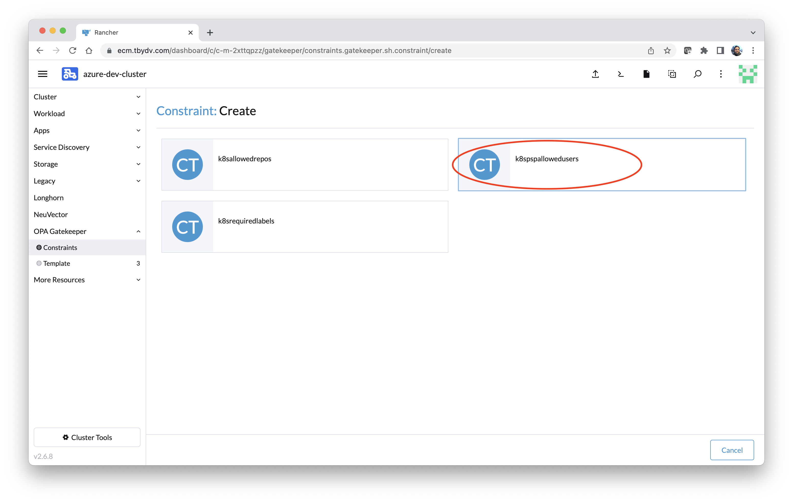
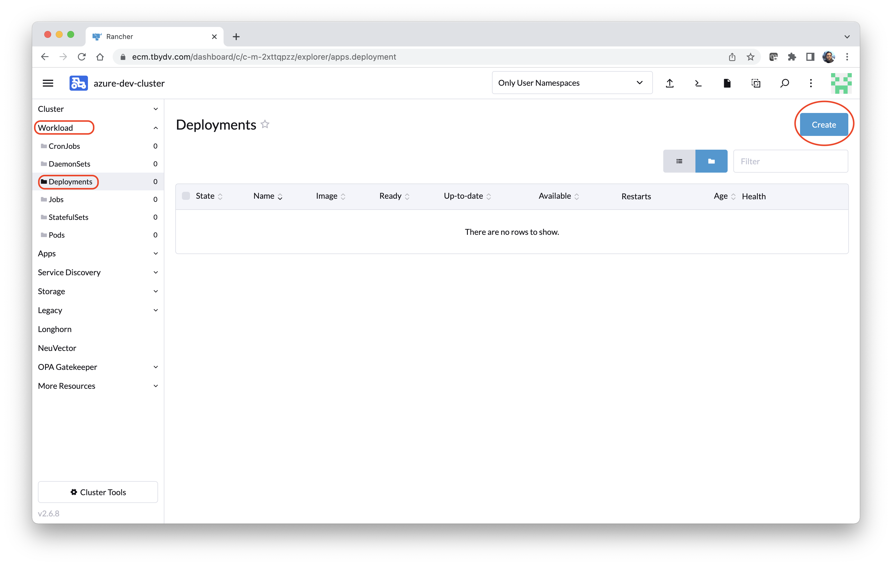
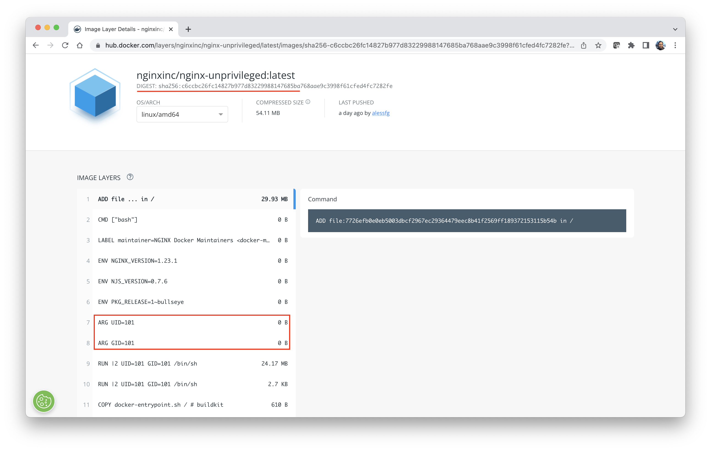
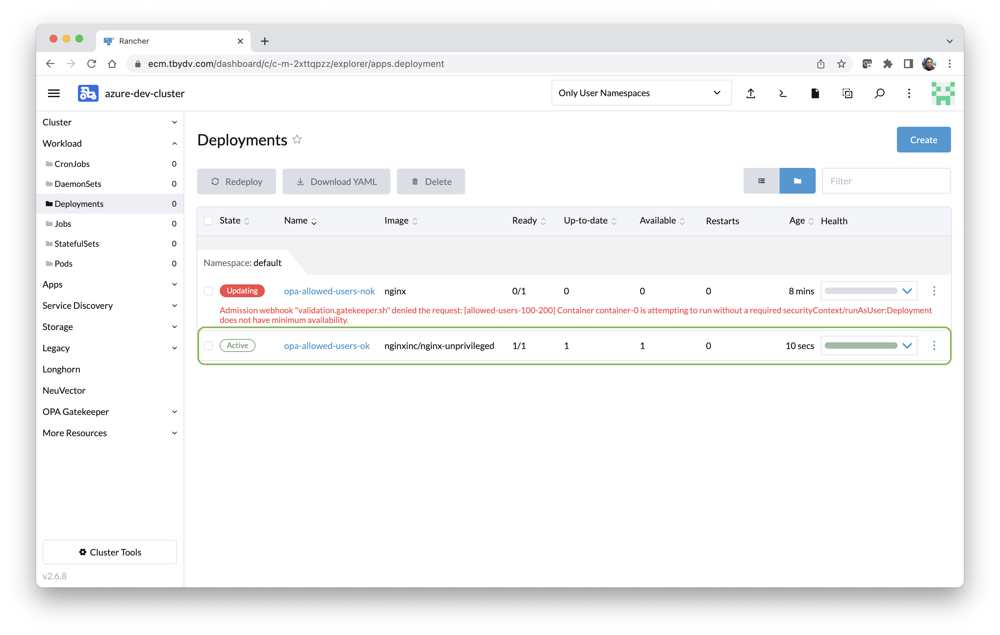

# Lab 1 - Open Policy Agent Gatekeeper

This exercise is independent. We'll experience ease of installing Open Policy Agent (OPA) from Rancher cluster tools and quickly setup the constaint to allow run only non-root containers. 

###### Usecase: Generally docker containers run with root privileges which is useful for the developers because of unrestricted container management e.g. installing packages, changing configurations, associating privileged ports etc. But running containers as root in QA and Production isn't a good security practice and can cause malicious process to gain non-federated access which in turn be catastrophic. Using OPA, we can create such policy which restrict cluster to run container as root user.     


## Task 1: Install Open Policy Agent (OPA) 

This action will involve 2 steps from 2B.1 to 2B.2

**Step 1)** Ensure that you are logged in to the Rancher (Refer to the Step 1 of section **Before We Begin**). Click on `Hamburger Menu icon (1)`. It will show list of clusters. Alternatively click on `Cluster Management (2)` .



**Step 2)** Click on `Explore` button on downstream cluster `rke2-cluster1` from the main screen.


**Step 3)** Now click on `Cluster Tools` on the botton of the left hand side static menu.  


**Step 4)** Identify **OPA Gatekeeper** card and click on `Install` button. 


**Step 5)** Choose `Default` value from **Install into Project** and click on `Next` button. 


**Step 6)** Now click on `Install` button. 


**Step 7)** Verify that installation is successfully completed and SUCCESS message is displayed. Close the logging screen by clicking on "x" button.  


**End of Task 1**


## Task 2: Define OPA Template

This action will involve 4 steps from 1 to 4

**Step 1)** Go to `OPA Gatekeeper` menu option and select `Template`. Now click on `Create from YAML` at the right upper screen. 


**Step 2)** Remove pre-filled text from the template editor. 


**Step 3)** Specify template.yaml file content in the editor. Please refer below git link (Please open link in new tab)

[OPA-User-Template](/template.yaml)



**Step 4)** Verify that template `k8spspallowedusers` is successfully create. 



**End of Task 3**

## Task 4: Setup OPA Constraint

This action will involve 6 steps from 1 to 6

**Step 1)** A new **OPA Gatekeeper** menu will appear in left side static menu. Expand menu and click on `Constratint` submenu. Click on `Create` to proceed. 


**Step 2)** Select `k8spspallowedusers` from the screen. 



**Step 3)** Fill the `Name` field of the Constraint and leave the field `Enforcement Action` to default vale `deny-deny` 

`Name : user's choice e.g. allowed-users-100-200`

`Enforcement Action : deny-deny admission request with any violation (Default)`

On the constraint creation screen, we have three tabs namely `Namespaces`, `Rules` and `Parameters`. Provide following details under the `Namespaces` tab.

`Scope : Cluster & Namespaced (From the dropdown)`

`Excluded Namespaces : kube-system, cattle-* (Manually choose all "cattle-" namespces)`

Now navigate to the `Rules` tab.


**Step 4)** Click on Add `Kind` button twice to create two rows for Kind values. Fill values `Pod` and `Deployment`. Now click on `Parameters` link.  


**Step 5)** Specify following yaml values and click `Create`.  

```yaml
runAsUser:
      rule: MustRunAs # MustRunAsNonRoot # RunAsAny 
      ranges:
        - min: 100
          max: 200
```


**Step 6)** Verify that constraint is successfully created. Now proceed to validate if the defined constraint is working as expected i.e. deployment pulling container image from ACR will be successful while Harbor will be failed. 

Now click on `Workload` option from the left hand static menu and select `Deployments` sub menu. 


**End of Task 4**

## Task 5: Validate constraint - Create deployment to run container as root user and our policy shouldn't allow to admit the container. 

This action will involve 5 steps from 1 to 5

**Step 1)** Make sure that you are at the Deployment screen in Rancher. Click on `Create`.




**Step 2)** Deployment screen has 3 tabs `Deployment`, `Pod` and `Containers`. Fill in following details on the Deployment screen. 

`Namespace : default`

`Name : user's choice e.g. opa-allowed-users-nok`

Now navigate to the `Containers` tab. 


**Step 3)** Fill following details on `Containers` tab. 

`Container Image : nginx:latest`


**Step 4)** Now scroll down and stop at `Security Context` to ensure the default value of `Run as Non-Root` to `No` means container will run as root user. 


**Step 5)** Click `Create` and verify that OPA constraint has stopped creating the deployment. You'll notice that the error message is clearly stating that allowed user range is between 100-200 and our container is trying to run as user id 0. 


**End of Task 5**

## Task 6: Validate deployment - Create deployment to run container as non-root user and our policy should admit the container. 

This action will involve 6 steps from 1 to 6

**Step 1)** That was Good! Now let us see if the container runs with non-root user e.g. 101 which is within the specified range. 

For this exercise, we have to use one such container which is build to run as non-root e.g. `nginxinc/nginx-unprivileged:latest`. 



**Step 2)** Create a fresh deployment with following details. 

`Namespace : default`

`Name : user's choice e.g. opa-allowed-users-ok`

Now navigate to the `Containers` tab. 

`Container Image : nginxinc/nginx-unprivileged:latest`


**Step 3)** Now scroll down and stop at `Security Context` to change the default value of `Run as Non-Root` to `Yes` means container will run as non-root user. Also specify the value of field `Run as UserID`  to `101`. 


**Step 4)** Now click `Create` and verify that deployment is created successfully. 



**Step 5)** Let's validate if the container is really running as non-root user i.e. 101. Click on the 3 vertical dots menu at the right end of the new created deployment and click on ` > Execute Shell`. It will open an inline window just below the Deployment section. 


**Step 6)** Execute command `id` in the shell and verify that `uid`, `gid`, and `groups` values are 101 as specified in the container image. 


Bingo! The OPA constraint is working as we were expecting. But wait... How much you are familiar with REGO language and how much effort it will require to create an OPA template if you are relatively newer in this space? Definitely, there are readymade templates available on git [gatekeepr-library](https://github.com/open-policy-agent/gatekeeper-library) which you may explore. However, there are good alternatives for advance policy control like `ARP Spoofing` etc. Let's conclude it here the and move on to the next exercise to explore Kubewarden. 

**End of Task 6**

**End of LAB 1**

Continue to: [Lab 2: Kubewarden](/docs/Lab02-Kubewarden.md)


